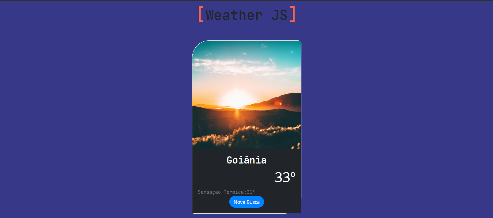

# Português

# Weather JS

# Busca de clima por cidade, usando Vanilla JS, com a API da Open Weather.

# Ao iniciar a aplicação, será pedido a autorização para acessar sua localização através do navegador, se aceitarem, fará a busca automaticamente do clima da sua localização.

# Exercício de fixação de Javascript

# Para testar, você precisa ter uma apiKEY gerada pela Open Weather (https://openweathermap.org/api), colocar na linha 1 do arquivo JS e poderá testar.

# Lembrando que o foco não está no visual, mas sim nas funcionalidades do exercício.

# English

# Weather search by city using Vanilla JS, with the Open Weather API.

# Javascript Fixing Exercise

# To test, you need to have an apiKEY generated by Open Weather (https://openweathermap.org/api), put it on line 1 of the JS file and you can test it.

# When starting the application, authorization will be requested to access your location through the browser, if they accept, it will automatically search for the weather of your location.

# Remembering that the focus is not on the visual, but on the exercise's functionalities.

